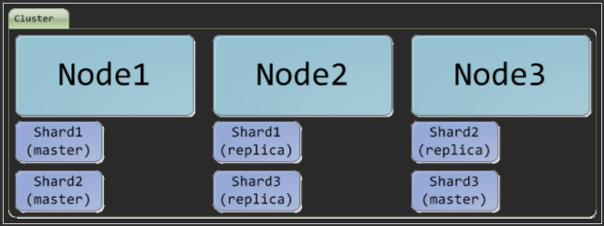
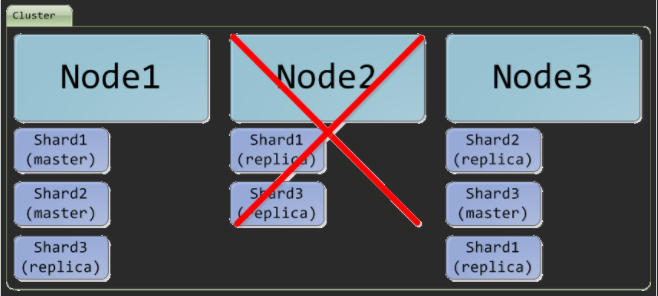

# Docker-ElasticsearchCluster

Elasticsearch Cluster 建置備忘錄

---

* Node：Elasticsearch 可以用單一站台或叢集的方式運作，以一個整體的服務對外提供搜尋的功能，一個安裝有 Elasticsearch 服務的站台就稱為是一個 Node。
* Cluster：想當然爾，一群安裝有 Elasticsearch 服務的站台們，就稱為是 Cluster。
* Field：這是 Elasticsearch 儲存資料的最小單位，類似於關聯式資料庫的 Column。
* Document：若干個 Field 集合成一個 Document，類似於關聯式資料庫的 Row，每一個 Document 都有一個唯一的 ID 作為區分。
* Type：一個 Document 必須隸屬於一個 Type，類似於關聯式資料庫的 Table。
* Index：一個 Type 必須隸屬於一個 Index，類似於關聯式資料庫的 Database。

---

* Shard：通常叫做分片，這是 Elasticsearch 提供分散式搜尋的基礎，其含義是將一個完整的 Index 分成若干部分，儲存在相同或不同的 Node 上，這些組成 Index 的部分就叫做 Shard。
* Replica：意思跟 Replication 差不多，就是 Shard 的備份，所以一個 Index 的 Shard 數量就等於 Shard × (1 + Replica)。

---


#### 分散式的特性 - 備份不重覆



#### 分散式的特性 - 自動還原資料



----

#### 建立測試叢集

因為考慮需要上到Production環境,所以不考慮使用compose來進行測試評估

需要使用compose進行測試可以看[這裡](docker-compose.yml)

```bash
# 第一台測試機
docker run \
  -d \
  -m=4g \
  --memory-swap=4g \
  --name=elasticsearch_6.5.1_1 \
  -p 65430:9200 \
  -p 65431:9300 \
  --ulimit memlock=-1:-1 \
  -e ES_JAVA_OPTS="-Xms512m -Xmx512m" \
  -v /data/elasticsearch_1:/usr/share/elasticsearch/data \
  elasticsearch:6.5.1 

# 第二台測試機
docker run \
  -d \
  -m=4g \
  --memory-swap=4g \
  --name=elasticsearch_6.5.1_2 \
  -p 65432:9200 \
  -p 65433:9300 \
  --ulimit memlock=-1:-1 \
  -e ES_JAVA_OPTS="-Xms512m -Xmx512m" \
  -v /data/elasticsearch_2:/usr/share/elasticsearch/data \
  elasticsearch:6.5.1 

# 第三台測試機
docker run \
  -d \
  -m=4g \
  --memory-swap=4g \
  --name=elasticsearch_6.5.1_1 \
  -p 65430:9200 \
  -p 65431:9300 \
  --ulimit memlock=-1:-1 \
  -e ES_JAVA_OPTS="-Xms512m -Xmx512m" \
  -v /data/elasticsearch_1:/usr/share/elasticsearch/data \
  elasticsearch:6.5.1
```

Q：為什麼docker不考慮使用-e建置環境參數？

Ans:沒辦法快速更新elasticsearch.yml,系統設定參數,也可以選擇把yml打包成專屬自己使用的docker images

如何把分散node組合成新的cluster

```bash
# 第一台設定
docker cp \ 
  elasticsearch_6.5.1_1:/usr/share/elasticsearch/config/elasticsearch.yml /{yml backup path}

vim /{yml backup path}
```

打開從container內複製出來的yml進行編輯

```bash
cluster.name: "cluster-0"
network.host: 0.0.0.0

# minimum_master_nodes need to be explicitly set when bound on a public IP
# set to 1 to allow single node clusters
# Details: https://github.com/elastic/elasticsearch/pull/17288
discovery.zen.minimum_master_nodes: 2
discovery.zen.ping.unicast.hosts: "10.101.1.62:65433,10.101.1.62:65435"
```

編輯完成後,將yml重新放回container內,並重新啟動container

```bash
docker cp \ 
  /{yml backup path}/elasticsearch.yml elasticsearch_6.5.1_1:/usr/share/elasticsearch/config/elasticsearch.yml

docker restart elasticsearch_6.5.1_1
```

可連結 http://{node_ip}:{node_port}/_nodes/ 查詢節點狀態

另外,附上部分我找到的參數說明

```yml
# ======================== Elasticsearch Configuration =========================
#
# ---------------------------------- Cluster -----------------------------------
#
# 配置Elasticsearch的叢集名稱，預設是elasticsearch
#
cluster.name: elasticsearch
#
# ------------------------------------ Node ------------------------------------
#
# 節點名，預設隨機指定一個name列表中名字。叢集中node名字不能重複
node.name: search01-node1
#
#
#################################### Index ####################################
#
# 設定每個index預設的分片數，預設是5
#
index.number_of_shards: 2
# 
# 設定每個index的預設的冗餘備份的分片數，預設是1
index.number_of_replicas: 1
# ----------------------------------- Paths ------------------------------------
#
# 索引資料的儲存路徑，預設是es根目錄下的data資料夾
#
# path.data: /path/to/data
#
# 日誌路徑:
#
# path.logs: /path/to/logs
#
# ----------------------------------- Memory -----------------------------------
#
# 啟動時開啟記憶體鎖，防止啟動ES時swap記憶體。
#
bootstrap.memory_lock: true
#
#
# ---------------------------------- Network -----------------------------------
#
# Set the bind address to a specific IP (IPv4 or IPv6):
#
# 繫結的ip地址, 可以是hostname或者ip地址，用來和叢集中其他節點通訊，同時會設定network.publish_host,以及network.bind_host
network.host: 0.0.0.0
#設定繫結的ip地址，生產環境則是實際的伺服器ip，這個ip地址關係到實際搜尋服務通訊的地址，和服務在同一個叢集環境的可以用內網ip，預設和network.host相同。
network.publish_host: 0.0.0.0
#設定繫結的ip地址，可以是ipv4或ipv6的，預設和network.host相同。
network.bind_host: 0.0.0.0
#節點間互動的tcp埠，預設是9300
transport.tcp.port: 9300
#設定對外服務的http埠，預設為9200
http.port: 9200
transport.tcp.compress: true
設定是否壓縮tcp傳輸時的資料，預設為false，不壓縮。
#
# --------------------------------- Discovery ----------------------------------
#
# 啟動時初始化叢集的服務發現的各個節點的地址。
discovery.zen.ping.unicast.hosts: ["127.0.0.1:9300","host2:9300","host3:9300"]
#設定這個引數來保證叢集中的節點可以知道其它N個有master資格的節點。預設為1。為了防止選舉時發生“腦裂”，建議配置master節點數= （總結點數/2   1）
discovery.zen.minimum_master_nodes: 1
#
# ---------------------------------- Gateway -----------------------------------
#
# 設定叢集中N個節點啟動之後才可以開始資料恢復，預設為1。
gateway.recover_after_nodes: 1
#
# ---------------------------------- Various -----------------------------------
#
# node.max_local_storage_nodes: 1
#
# 設定刪除索引時需要指定索引name，防止一條命令刪除所有索引資料。預設是true
#
action.destructive_requires_name: true
```

#### Elastic HQ

```bash
docker run \
  -d \
  --name elastichq \
  -p 55000:5000 \
  elastichq/elasticsearch-hq:release-v3.4.1
```

#### Kibana

```bash
docker run \
  -d \
  --name kibana \
  -e elasticsearch.url=srvdocker2-t:49200 \
  -p 55601:5601 \
  kibana:6.5.1
```
